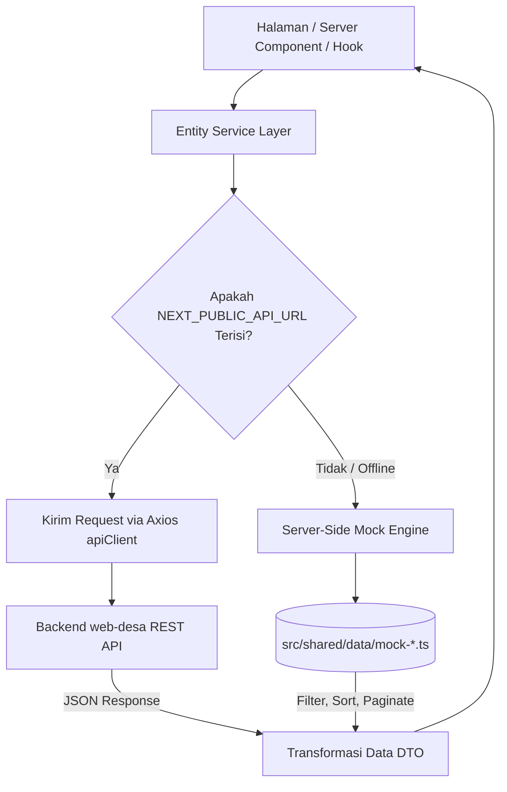

# 02. Data Fetching & Dual-Mode Architecture — Web Desa Pringgodani

Dokumen ini menjelaskan mekanisme pengambilan data (*Data Fetching*) pada frontend dan implementasi **Dual-Mode Data Architecture** yang menghubungkan aplikasi dengan backend live atau beralih otomatis ke data tiruan (*mock data*).

---

## 1. Konsep Arsitektur Dual-Mode

Aplikasi frontend didesain dengan pola **Dual-Mode Data Source**:
1. **Mode Live API (Utama)**: Digunakan pada lingkungan produksi (*production*) dan saat server backend aktif. Seluruh permintaan data dikirimkan melalui HTTP REST API ke backend `web-desa`.
2. **Mode Mock Data (Fallback)**: Aktif secara otomatis jika variabel lingkungan `NEXT_PUBLIC_API_URL` tidak diisi (kosong). Data diambil dari berkas statis `src/shared/data/mock-*.ts` dengan simulasi pencarian, penyaringan (*filtering*), dan *pagination* di sisi server/klien.

### Diagram Alur Dual-Mode Data Fetching



---

## 2. Implementasi pada Service Layer

Setiap modul bisnis memiliki Service terisolasi di `src/entities/*/api/`. Tidak ada komponen UI yang diizinkan memanggil `fetch()` atau `apiClient` secara langsung tanpa melalui Service.

### Contoh Implementasi Dual-Mode (`NewsService`)

```typescript
// src/entities/berita/api/news.service.ts
import { apiClient } from "@/shared/api/axios-instance";
import { MOCK_NEWS } from "@/shared/data/mock-news";
import type { NewsDetailDto, NewsListResponse } from "../model/types";

export class NewsService {
  static async getNews(params?: {
    page?: number;
    limit?: number;
    search?: string;
    category?: string;
  }): Promise<NewsListResponse> {
    const isLiveApi = Boolean(process.env.NEXT_PUBLIC_API_URL);

    // MODE 1: Live API
    if (isLiveApi) {
      const response = await apiClient.get("/public/news", { params });
      return response.data;
    }

    // MODE 2: Fallback Mock Data
    const page = params?.page || 1;
    const limit = params?.limit || 9;
    let filtered = [...MOCK_NEWS];

    if (params?.search) {
      filtered = filtered.filter((n) =>
        n.title.toLowerCase().includes(params.search!.toLowerCase()),
      );
    }
    if (params?.category && params.category !== "ALL") {
      filtered = filtered.filter((n) => n.category.slug === params.category);
    }

    const total = filtered.length;
    const paginated = filtered.slice((page - 1) * limit, page * limit);

    return {
      success: true,
      data: paginated,
      meta: {
        page,
        limit,
        total,
        totalPages: Math.ceil(total / limit),
      },
    };
  }
}
```

---

## 3. Konfigurasi Axios Client (`apiClient`)

Klien HTTP utama diinisialisasi pada `src/shared/api/axios-instance.ts`:

* **Base URL**: Mengambil dari `process.env.NEXT_PUBLIC_API_URL` (default: `/api` untuk proxy lokal).
* **Timeout**: Ditetapkan 15.000 ms (15 detik) untuk mencegah permintaan menggantung.
* **Header Interceptor**: Otomatis menyematkan token JWT dari `localStorage` atau *Cookie* pada setiap permintaan administratif.
* **Error Interceptor**: Menyeragamkan penanganan galat jaringan (*network errors*) dan *unauthorized responses* (401/403).

---

## 4. Pola Server Components vs Client Components

* **Server Components (RSC)**: Digunakan secara default pada halaman publik (`(public)/**/page.tsx`) untuk mengambil data awal saat proses *Server-Side Rendering* (SSR) demi performa SEO dan kecepatan rendering pertama (*First Contentful Paint*).
* **Client Components (`"use client"`)**: Digunakan pada formulir pendaftaran, dashboard admin interaktif, editor berita/UMKM, dan kanvas peta interaktif yang membutuhkan interaksi pengguna dan state lokal React.
