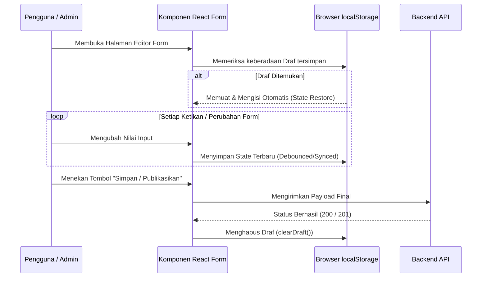

# 03. Manajemen Form, Draft, & Upload Gambar — Web Desa Pringgodani

Dokumen ini membedah arsitektur pengelolaan formulir, sistem penyimpanan draf otomatis (*Auto-Save Draft*), serta mekanisme kompresi gambar di sisi klien sebelum diunggah ke backend.

---

## 1. Validasi Formulir dengan Zod Schemas

Seluruh formulir input data publik maupun administratif divalidasi menggunakan skema **Zod** yang terpusat di `src/entities/*/model/*.schema.ts`.

### Keuntungan Pendekatan Zod:
1. **Type-Safety Penuh**: Tipe data TypeScript dihasilkan secara otomatis dari skema melalui `z.infer<typeof schema>`.
2. **Pesan Validasi Terlokalisasi**: Pesan galat disajikan dalam Bahasa Indonesia yang informatif dan ramah pengguna.
3. **Pembersihan Data Otomatis (*Sanitization*)**: Zod otomatis melakukan *trimming* spasi, konversi angka, dan validasi format URL/nomor WhatsApp.

---

## 2. Sistem Auto-Save Draft (`localStorage`)

Untuk mencegah hilangnya data input yang panjang saat admin atau warga tidak sengaja menutup tab, merefresh halaman, atau mengalami gangguan koneksi, formulir editor dilengkapi mekanisme **Auto-Save Draft**:

### Kunci Draf Penyimpanan (*Draft Keys*)
* Admin Editor UMKM: `admin_umkm_draft_v1`
* Admin Editor Berita: `admin_news_draft_v1`
* Pendaftaran UMKM Warga: `public_umkm_register_draft`
* Pengajuan Berita Warga: `public_news_register_draft`

### Siklus Hidup Draf (*Draft Lifecycle*)



---

## 3. Kompresi Gambar di Sisi Klien (*Client-Side Compression*)

Sebelum berkas gambar diunggah ke server, aplikasi melakukan kompresi otomatis menggunakan HTML5 Canvas di `src/shared/utils/image-compression.ts`.

### Alasan Kompresi di Browser:
* **Menghemat Kuota Pengguna**: Foto kamera ponsel (5MB - 15MB) dikompresi menjadi ~150KB - 300KB tanpa penurunan kualitas visual yang signifikan.
* **Mempercepat Waktu Upload**: Proses unggah berkas ke backend dan Supabase Storage berlangsung 10x lebih cepat.
* **Mencegah Batas Ukuran Payload Server**: Menghindari galat *413 Payload Too Large* pada fungsi serverless Vercel.

### Preset Kompresi yang Tersedia

| Preset | Resolusi Maksimal | Kualitas JPEG/WebP | Penggunaan Utama |
| :--- | :---: | :---: | :--- |
| `banner` | 1200 px | 82% | Foto sampul berita, banner slider beranda, foto sampul UMKM |
| `gallery`| 1000 px | 80% | Galeri foto kegiatan desa, foto produk komoditas |
| `avatar` | 400 px | 85% | Foto profil kepala desa, foto struktur perangkat desa |
| `thumbnail`| 300 px | 75% | Ikon & cuplikan mini gambar |

### Alur Eksekusi Upload Media

```typescript
// 1. Kompresi gambar lokal
const compressedBlob = await compressImage(file, "banner");

// 2. Bungkus ke dalam FormData
const formData = new FormData();
formData.append("file", compressedBlob);
formData.append("category", "umkm");

// 3. Unggah ke Backend API
const { data } = await apiClient.post("/uploads?category=umkm", formData);
const publicCdnUrl = data.data.url;

// 4. Sertakan publicCdnUrl ke payload data UMKM
```
